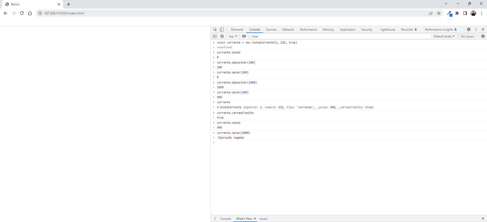
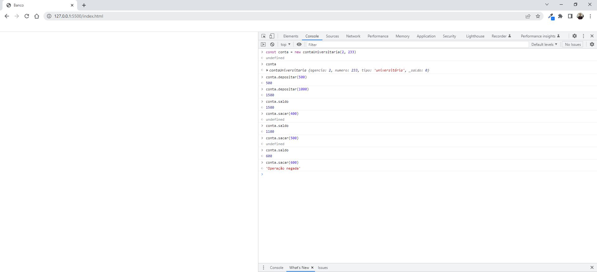

# Projeto do bootcamp JavaScript DIO - JS Orientado a Objetos

##

Repositório da <a href="https://github.com/stebsnusch/basecamp-javascript/tree/main/orientacao-a-objetos">stebsnusch</a>

## Atividade: Conta Bancária

Nesta atividade, vamos testar os conceitos de Orientação a Objetos simulando a criação de diversos tipos de contas bancárias e operações disponíveis em cada uma.

1. Crie a classe `ContaBancaria`, que possui os parâmetros `agencia`, `numero`, `tipo` e `saldo`;
2. Dentro de `ContaBancaria`, construa o getter e o setter de `saldo`;
3. Dentro de `ContaBancaria`, crie os métodos `sacar` e `depositar`;
4. Crie uma classe-filha chamada `ContaCorrente` que herda todos esses parâmetros e ainda possua o parâmetro `cartaoCredito`;
5. Ainda em `ContaCorrente`, construa o getter e o setter de `cartaoCredito`;
6. Ainda em `ContaCorrente`, faça com que o `tipo` seja 'conta corrente' por padrão;
7. Crie uma classe-filha chamada `ContaPoupanca` que herda todos os parâmetros de `ContaBancaria`;
8. Crie uma classe-filha chamada `ContaUniversitaria` que herda todos os parâmetros de `ContaBancaria`;
9. Faça com que o método `saque` de `ContaUniversitaria` apenas seja capaz de sacar valores **menores que 500 reais**.

